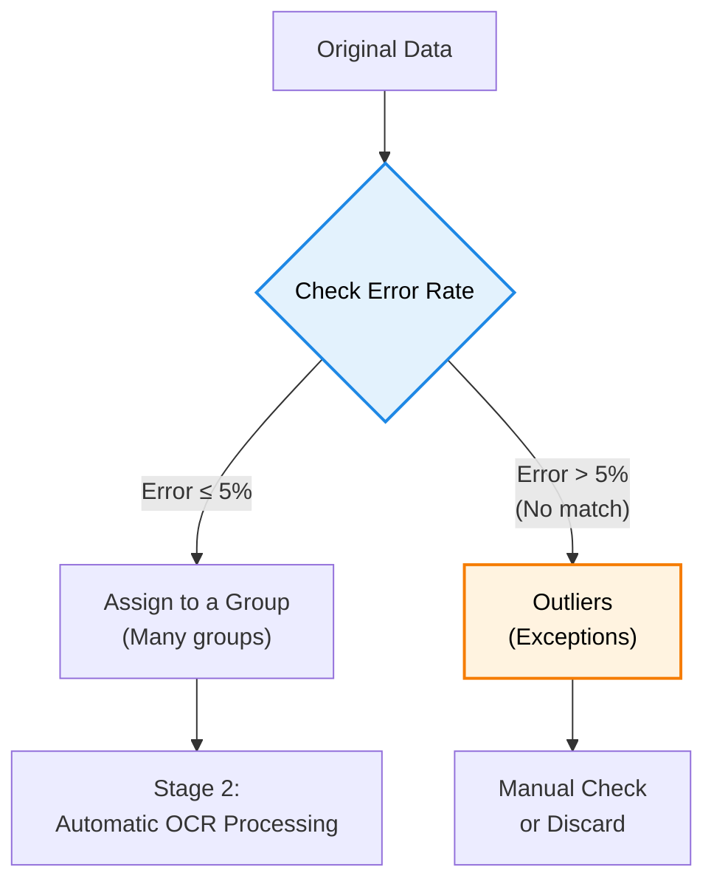

# Auto-labeling: Adaptive Pre-Grouping for High-Efficiency Industrial Meter OCR

> An adaptive, semi-automated annotation framework featuring spatial offset compensation and human-in-the-loop (HITL) optimization. It is designed to overcome unstable lighting conditions and accelerate dataset creation for industrial OCR.

## 📌 Background & Motivation

* **The Bottleneck:** Data annotation is the most time-consuming phase when training deep learning models for industrial meter OCR.
* **Unstable Factory Lighting:** Unstable lighting conditions in factories cause severe feature confusion (e.g., misclassifying 0/1, 7/1, decimal points, and negative signs).
* **Tool Limitations:** Traditional tools like LabelImg lack dynamic offset adjustment, making the manual annotation of thousands of highly similar images inefficient and prone to human error.

## 💡 Proposed Methodology

Our framework introduces a semi-automated pipeline leveraging **Spatial Similarity (Geometric Offset)**. It drastically reduces manual labor while utilizing a group-based method to separate outliers and maintain dataset quality.

### Stage 1: Automatic Grouping & Handling Exceptions

* **Continuous Matching:** The system reviews each new, unannotated image and compares it with existing groups.
* **Grouping Rule (±5%):** If the error rate is within ±5% compared to a group's base image, it is assigned to that group. This ensures all data within a group are highly similar.
* **Separating Exceptions:** If an image doesn't match any group (error > 5%), it is moved to an "Exception Pool" for manual review. This guarantees that only clean data enters the automated process.



### Stage 2: Bootstrap & Automatic Processing

* **Initial Setup (Bootstrap):** The first image of every stable group requires a manual check to set the bounding box and baseline text (Anchor).
* **Automatic Processing:** For the rest of the images in the group, the system automatically:
  1. Calculates the position difference (offset) compared to the base image.
  2. Adjusts the bounding box to the correct position dynamically.
  3. Runs the OCR engine inside the adjusted box.
* **Data Storage:** All corrected boxes, OCR results, and related information are automatically saved to the database.

## 🚀 Technical Highlights

* **Double-Check Mechanism:** If the AI is not confident in its result, the system triggers a second review to prevent reading errors and overcome feature confusion.
* **Fast Image Processing:** To meet strict low-latency requirements, we use classic Binarization techniques (instead of heavy AI models) to calculate image height and resize images quickly.
* **Image Comparison:** Images are resized and placed side-by-side to easily compare specific features.
* **Interactive User Interface (HITL):** A custom PyQt6 interface allows users to pause the automated process and adjust settings (like blur strength or contrast) to handle bad factory lighting. The system remembers and reuses these optimized settings.

## 📊 Performance & Impact

* **Time-Saving:** Reduced processing time per image by over 80% (from 1.0 seconds to under 0.2 seconds), successfully meeting the strict demands of production lines.
* **Higher Accuracy:** Greatly reduced the chance of mixing up similar characters through our special offset adjustment and double-check methods.
* **Proven Reliability:** Successfully tested and proven on a real-world factory dataset of 6,200+ images.

## ⚙️ Quick Start

### Prerequisites
* Python 3.x
* OpenCV, PyQt6, Ultralytics (YOLO), EasyOCR

### Installation
Clone the repository and install the dependencies:

```bash
git clone [https://github.com/yuan0202/Auto-labeling.git](https://github.com/yuan0202/Auto-labeling.git)
cd Auto-labeling
pip install -r requirement.txt
